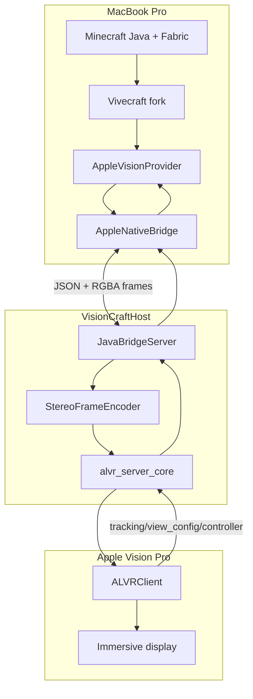

# VisionCraft architecture

## Product goal

Play **Minecraft Java Edition in VR** using only:

```text
MacBook Pro M4 → Minecraft + Vivecraft fork → VisionCraftHost + ALVR server_core → ALVRClient on Apple Vision Pro
```

MVP: seated play, head-tracked stereo, ALVR hand/gamepad-style controller input, crosshair block interaction, 30-minute survival session without hard crash.

Canonical repository names are defined in [repo-structure.md](repo-structure.md). Phase 0 keeps current top-level paths in place.

## Non-goals (MVP)

- SteamVR, cloud GPU, OpenXR runtime
- Roomscale locomotion and App Store shipping
- Forge/NeoForge, Sodium/Iris, App Store shipping

## System diagram



## Data flow (per frame)

1. ALVRClient reports head pose, view configuration, and raw controller inputs through `alvr_server_core`.
2. Host sends `pose`, `view_config`, and `controller` JSON → Java `ApplePoseProvider` / `AppleInputProvider`. While ALVR is connecting, the host keeps the bridge session in `paused` and only sends `ready` after tracking + negotiated `view_config` dimensions match the encoder target.
3. Vivecraft updates HMD matrices, controller actions, and triggers left/right render passes.
4. Minecraft renders to eye framebuffers (OpenGL).
5. `AppleFrameSubmitter` readbacks RGBA8 (MVP) and sends `frame` JSON + buffers.
6. Host packs side-by-side RGBA, encodes Annex-B HEVC with VideoToolbox, and submits NALs to `alvr_server_core`.
7. ALVRClient decodes and presents the stereo frame on Apple Vision Pro.

## Components

### Vivecraft Apple provider (`minecraft/VivecraftMod/`)

Fork VivecraftMod; add `org.vivecraft.client_vr.provider.apple`:

| Class | Role |
|-------|------|
| `AppleVisionProvider` | `MCVR` implementation; lifecycle, seated mode |
| `ApplePoseProvider` | Polls bridge for HMD pose + recenter |
| `AppleProjectionProvider` | Symmetric perspective per eye |
| `AppleFrameSubmitter` | Readback + bridge send |
| `AppleInputProvider` | Maps ALVR controller buttons/axes into Vivecraft `VRInputAction`s |
| `AppleSessionState` | Maps host `session` messages |
| `AppleVisionStereoRenderer` | `VRRenderer`; `endFrame()` submits |

Register `VRSettings.VRProvider.APPLE_VISION` and branch in `VRState.initializeVR()`.

### Mac ALVR host (`mac-host/`)

SwiftUI app using VideoToolbox + ALVR server_core (macOS 26+):

- `JavaBridgeServer` — TCP localhost, protocol v1
- `StereoFrameEncoder` — RGBA eye buffers → side-by-side Annex-B HEVC
- `AlvrServerCoordinator` — ALVR server_core lifecycle, event polling, controller JSON, video NAL submission
- `PosePublisher` — fallback pose publisher, suppressed while ALVR tracking is connected

### Bridge v1 (`bridge/`)

Versioned JSON control plane + binary frame payloads. Default port **19735**. See [bridge/protocol.md](../bridge/protocol.md).

Transport evolution:

1. **MVP:** CPU readback + socket (this repo)
2. **Next:** OpenGL PBO → shared memory
3. **Target:** OpenGL texture → IOSurface → Metal (`MetalInterop.mm`)

## Coordinate systems

| Space | Axes | Units |
|-------|------|-------|
| Minecraft | +Y up, yaw about Y | blocks (1 block = 1 m initially) |
| Apple compositor | Right-handed; verify against M0 sample | meters |
| Bridge pose | position_m, orientation_xyzw (JOML-compatible) | meters, unit quaternion |

Recenter increments `recenter_counter`; Java resets seated forward to Vision Pro forward.

## Vivecraft integration map

| Vivecraft | VisionCraft |
|-----------|-------------|
| `MCOpenVR` | `AppleVisionProvider` |
| `OpenVRStereoRenderer.endFrame()` | `AppleVisionStereoRenderer.endFrame()` → bridge |
| `VRInputAction` button/axis state | `AppleInputProvider` from `controller` JSON |
| `VRState` provider switch | Add `APPLE_VISION` |
| `NullVR` fake devices | Pattern for head-only + fake controllers |

## Milestones

See root [README.md](../README.md). The current gate is a real ALVRClient connection showing the synthetic side-by-side test pattern upright and fused.

## Risks

1. **OpenGL → Metal** — highest engineering risk; MVP uses CPU copy.
2. **Signing** — verify ALVRClient device signing/provisioning on personal team.
3. **Vivecraft OpenVR coupling** — provider abstraction via `MCVR` / `VRRenderer`.
4. **Frame pacing** — log render, encode, ALVR send/present, and pose age from day one.
