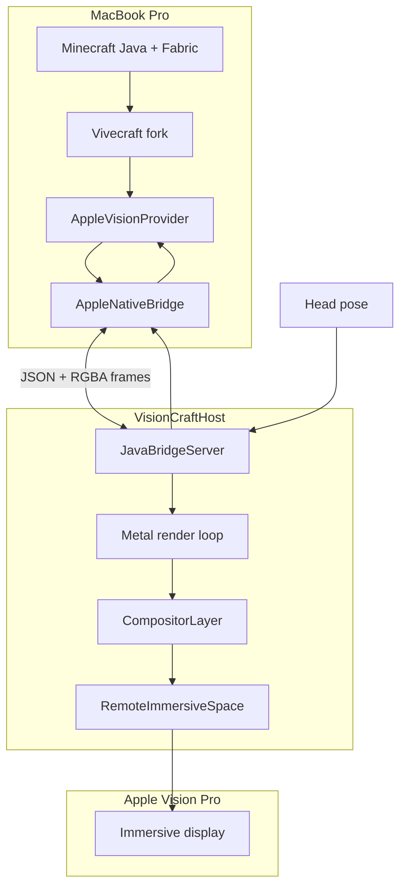

# VisionCraft architecture

## Product goal

Play **Minecraft Java Edition in VR** using only:

```text
MacBook Pro M4 → Minecraft + Vivecraft fork → macOS compositor bridge → Apple Vision Pro
```

MVP: seated play, head-tracked stereo, keyboard/mouse (optional gamepad), crosshair block interaction, 30-minute survival session without hard crash.

## Non-goals (MVP)

- SteamVR, ALVR, cloud GPU, OpenXR runtime
- Motion controllers, roomscale, hand tracking
- Forge/NeoForge, Sodium/Iris, App Store shipping

## System diagram



## Data flow (per frame)

1. Vision Pro reports head pose → macOS compositor session.
2. Host sends `pose` JSON → Java `ApplePoseProvider`.
3. Vivecraft updates HMD matrices and triggers left/right render passes.
4. Minecraft renders to eye framebuffers (OpenGL).
5. `AppleFrameSubmitter` readbacks RGBA8 (MVP) and sends `frame` JSON + buffers.
6. Host uploads to Metal textures and presents via Compositor Services.

## Components

### Minecraft mod layer (`minecraft/`)

Fork VivecraftMod; add `org.vivecraft.client_vr.provider.apple`:

| Class | Role |
|-------|------|
| `AppleVisionProvider` | `MCVR` implementation; lifecycle, seated mode |
| `ApplePoseProvider` | Polls bridge for HMD pose + recenter |
| `AppleProjectionProvider` | Symmetric perspective per eye |
| `AppleFrameSubmitter` | Readback + bridge send |
| `AppleInputProvider` | Keyboard/mouse; fake controllers |
| `AppleSessionState` | Maps host `session` messages |
| `AppleVisionStereoRenderer` | `VRRenderer`; `endFrame()` submits |

Register `VRSettings.VRProvider.APPLE_VISION` and branch in `VRState.initializeVR()`.

### Native macOS host (`mac-host/`)

SwiftUI app using `RemoteImmersiveSpace` + Compositor Services (macOS 26+):

- `CompositorRenderer` — Metal stereo compositor (M0: procedural cube)
- `JavaBridgeServer` — TCP localhost, protocol v1
- `FrameReceiver` — RGBA8 eye buffers → Metal textures
- `PosePublisher` — Device pose → Java

### Bridge (`bridge/`)

Versioned JSON control plane + binary frame payloads. Default port **19735**. See [bridge/protocol.md](../bridge/protocol.md).

Transport evolution:

1. **MVP:** CPU readback + socket (this repo)
2. **Next:** OpenGL PBO → shared memory
3. **Target:** OpenGL texture → IOSurface → Metal (`MetalInterop.mm`)

## Coordinate systems

| Space | Axes | Units |
|-------|------|-------|
| Minecraft | +Y up, yaw about Y | blocks (1 block = 1 m initially) |
| Apple compositor | Right-handed; verify against M0 sample | meters |
| Bridge pose | position_m, orientation_xyzw (JOML-compatible) | meters, unit quaternion |

Recenter increments `recenter_counter`; Java resets seated forward to Vision Pro forward.

## Vivecraft integration map

| Vivecraft | VisionCraft |
|-----------|-------------|
| `MCOpenVR` | `AppleVisionProvider` |
| `OpenVRStereoRenderer.endFrame()` | `AppleVisionStereoRenderer.endFrame()` → bridge |
| `VRState` provider switch | Add `APPLE_VISION` |
| `NullVR` fake devices | Pattern for head-only + fake controllers |

## Milestones

See root [README.md](../README.md). **M0 is the gate:** without `RemoteImmersiveSpace` + stereo Metal on device, do not invest in M3–M5.

## Risks

1. **OpenGL → Metal** — highest engineering risk; MVP uses CPU copy.
2. **Entitlements** — verify Compositor Services signing on personal team.
3. **Vivecraft OpenVR coupling** — provider abstraction via `MCVR` / `VRRenderer`.
4. **Frame pacing** — log render, copy, present, pose age from day one.
